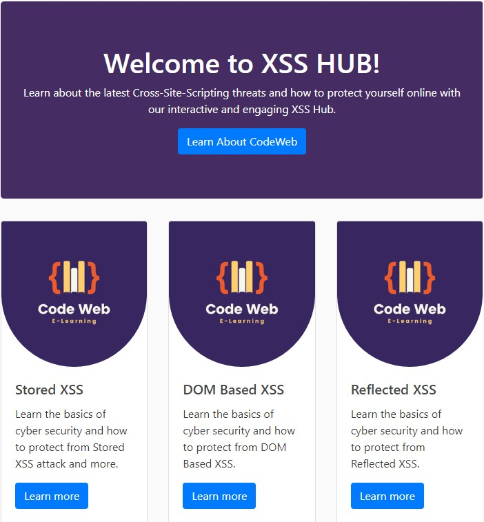
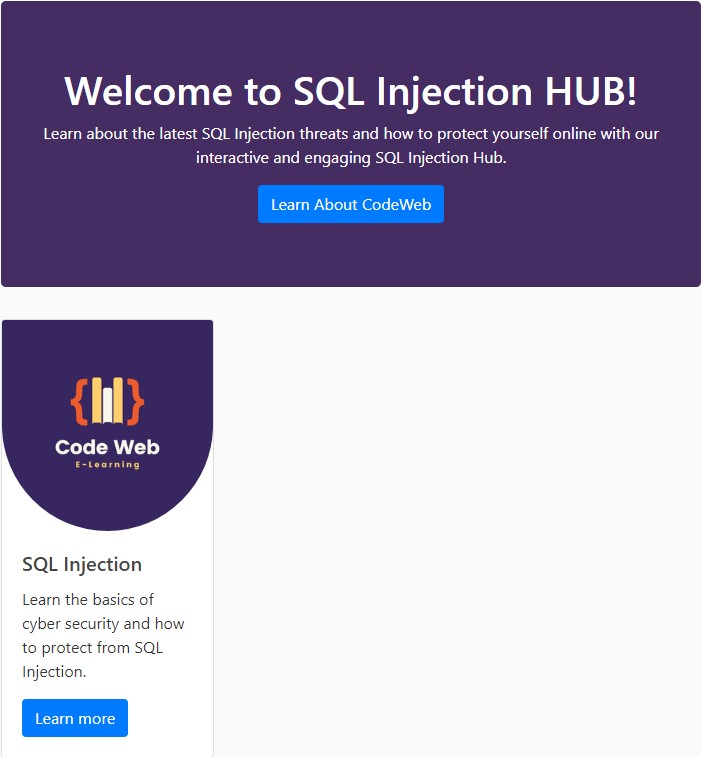
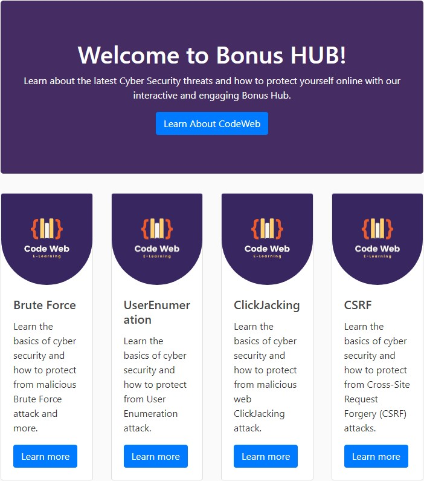

# 🛠 CodeWeb 🛠

This project is a web-based E-learning system that enables users to learn, implement, and protect against well-known web attacks, such as OWASP top 10. We integrated our knowledge as computer science students, combined with a course in computer security and cyber principles, to develop this system.

We understand that there are more and more cyber e-learning systems, and this is because they allow users to learn from anywhere and at any time, with access to updated and comprehensive information. Our system includes several components such as Content Management System (CMS), Learning Management System (LMS), advanced and accessible user interface, as well as software and tools for translation, data transfer, and resource management.


## Authors

- [@idanbuller](https://github.com/idanbuller)
- [@einavpincu](https://github.com/einavpi)


## Developed For

This project is developed for the following companies:

- [HIT (Holon Institute of Technology)](https://www.hit.ac.il/)


## Technologies

This project is developed with the following technologies:

- [Django Framework](https://www.djangoproject.com/)
- [Python](https://www.python.org/)
- [HTML](https://html.spec.whatwg.org/multipage/)
- [Jinja](https://jinja.palletsprojects.com/en/3.1.x/)
- [Heroku](https://www.heroku.com/)

## Demo

Insert gif or link to demo


## Features

#### ⚡️XSS HUB

Learn about the latest Cross-Site-Scripting threats and how to protect yourself online with our interactive and engaging XSS Hub:

- Stored XSS

- DOM Based XSS

- Reflected XSS

#### ⚡️SQL Injection

Learn about the latest SQL Injection threats and how to protect yourself online with our interactive and engaging SQL Injection Hub:

- SQL Injection

#### ⚡️Bonus HUB

Learn about the latest Cyber Security threats and how to protect yourself online with our interactive and engaging Bonus Hub:

- Brute Force

- User Enumeration

- ClickJacking

- CSRF


## Installation

Clone the project -

```python
  git clone https://github.com/idanbuller/CodeWeb
```

Go to the project directory -

```python
  cd CodeWeb
```

Install dependencies - 

```python
  pip install -r requirements.txt
```

Start the server - 

```python
  python manage.py runserver
```


## Code Examples
The following are key files that responsible for the project's GUI and features:

### django_project\settings.py
This is the configuration file of the project. Here is a brief explanation of what each section of the code does:

#### SECRET_KEY
A variable that stores a secret key used for securing the Django application. In this code, it is retrieved from an environment variable.

#### DEBUG
A boolean variable that determines whether debugging is enabled. In this code, it is set to True.

#### ALLOWED_HOSTS
A list of domain names that the Django application is allowed to serve.

#### INSTALLED_APPS
A list of Django applications that are installed and available for use.

#### MIDDLEWARE
A list of middleware classes that are used to process requests and responses.

#### ROOT_URLCONF
A variable that stores the root URL configuration for the Django application.

#### TEMPLATES
A list of template engines used for rendering HTML pages.

#### WSGI_APPLICATION
A variable that stores the WSGI application for the Django project.

#### DATABASES
A dictionary that stores the database configuration for the Django project. In this code, it is set up to use SQLite as the default database.

#### AUTH_PASSWORD_VALIDATORS
A list of password validation rules used for ensuring strong passwords.

#### LANGUAGE_CODE, TIME_ZONE, USE_I18N, USE_L10N, and USE_TZ
Variables used to configure the internationalization settings for the Django project.

#### STATIC_ROOT, STATIC_URL, and STATICFILES_DIRS
Variables used to configure the static files (CSS, JavaScript, images) for the Django project.

#### MEDIA_ROOT and MEDIA_URL
Variables used to configure the media files (uploaded by users) for the Django project.

#### CRISPY_TEMPLATE_PACK
A variable used to configure the template pack for the crispy_forms library.

#### LOGIN_REDIRECT_URL and LOGIN_URL
Variables used to configure the login and logout URLs for the Django project.

#### EMAIL_BACKEND, EMAIL_HOST, EMAIL_PORT, EMAIL_USE_TLS, EMAIL_HOST_USER, and EMAIL_HOST_PASSWORD
Variables used to configure the email settings for the Django project.

#### django_heroku.settings(locals())
A function call that configures the Django application to work with the Heroku platform.


### django_project\urls.py
This code the the URL configuration of the project.

- The urlpatterns list maps URLs to corresponding views in the Django application. In this particular example, there are several URL patterns defined, and each one is associated with a specific view function.

- The first URL pattern maps the URL /admin/ to the Django admin site. The second and third URL patterns map the URLs /register/ and /profile/ to the register and profile views respectively, which are defined in the users app.

- The fourth and fifth URL patterns map the URLs /login/ and /logout/ to the built-in Django authentication views for login and logout respectively, which are imported from django.contrib.auth.

- The next four URL patterns are related to the password reset feature. They map the URLs /password-reset/, /password-reset/done/, /password-reset-confirm/<uidb64>/<token>/, and /password-reset-complete/ to the corresponding built-in Django views for the password reset feature.

- Finally, the last URL pattern includes the URL configuration of another Django app called blog, by mapping the root URL to the blog.urls URL configuration.

- The last if statement is a check to see if the project is in debug mode, and if it is, it adds a URL pattern for serving media files at settings.MEDIA_URL. This is done using the static() function imported from django.conf.urls.static. The document_root argument specifies the local directory to serve the media files from.

```python
urlpatterns = [
    path('admin/', admin.site.urls),
    path('register/', user_views.register, name='register'),
    path('profile/', user_views.profile, name='profile'),
    path('login/', auth_views.LoginView.as_view(template_name='users/login.html'), name='login'),
    path('logout/', auth_views.LogoutView.as_view(template_name='users/logout.html'), name='logout'),
    path('password-reset/',
         auth_views.PasswordResetView.as_view(
             template_name='users/password_reset.html'
         ),
         name='password_reset'),
    path('password-reset/done/',
         auth_views.PasswordResetDoneView.as_view(
             template_name='users/password_reset_done.html'
         ),
         name='password_reset_done'),
    path('password-reset-confirm/<uidb64>/<token>/',
         auth_views.PasswordResetConfirmView.as_view(
             template_name='users/password_reset_confirm.html'
         ),
         name='password_reset_confirm'),
    path('password-reset-complete/',
         auth_views.PasswordResetCompleteView.as_view(
             template_name='users/password_reset_complete.html'
         ),
         name='password_reset_complete'),
    path('', include('blog.urls')),
]
```

### users\views.py
This code defines two views for CodeWeb's application related to user authentication and registration.

- The register view handles the registration form submission. If the request method is POST, it attempts to validate and save the form data. If the form is valid, it creates a new user account and redirects the user to the login page with a success message. If the form is invalid, it re-renders the registration page with the errors displayed. If the request method is GET, it just renders the registration page with an empty form.

- The profile view handles user profile updates. If the request method is POST, it attempts to validate and save the updated user and profile information. If both forms are valid, it updates the user and profile information and redirects the user to their profile page with a success message. If the forms are invalid, it re-renders the profile page with the errors displayed. If the request method is GET, it just renders the profile page with the existing user and profile information.

- The @login_required decorator on the profile view ensures that only logged-in users can access this page. If an unauthenticated user attempts to access this view, they will be redirected to the login page. The UserUpdateForm and ProfileUpdateForm classes used in the profile view are imported from a separate forms.py file and are responsible for rendering and validating the user and profile update forms.

- The messages framework is used to display success messages after a successful form submission or action.

```python
def register(request):
    query = request.GET.get('')
    if request.method == 'POST':
        form = UserRegisterForm(request.POST)
        if form.is_valid():
            form.save()
            username = form.cleaned_data.get('username')
            messages.success(request, f'Your account has been created! You are now able to log in')
            return redirect('login')
    else:
        form = UserRegisterForm()
    return render(request, 'users/register.html', {'form': form})


@login_required
def profile(request):
    if request.method == 'POST':
        u_form = UserUpdateForm(request.POST, instance=request.user)
        p_form = ProfileUpdateForm(request.POST,
                                   request.FILES,
                                   instance=request.user.profile)
        if u_form.is_valid() and p_form.is_valid():
            u_form.save()
            p_form.save()
            messages.success(request, f'Your account has been updated!')
            return redirect('profile')

    else:
        u_form = UserUpdateForm(instance=request.user)
        p_form = ProfileUpdateForm(instance=request.user.profile)

    context = {
        'u_form': u_form,
        'p_form': p_form
    }

    return render(request, 'users/profile.html', context)
```


### blog\urls.py
This code defines the URL patterns for CodeWeb's web application. Each URL pattern is associated with a specific view function that gets called when the user requests that URL.

- The urlpatterns list starts by importing several view functions from a views.py file. These functions correspond to different pages in the application, such as the home page, user profile pages, and various blog posts. It also imports a function called change_password from the same views.py file.

- Each URL pattern in urlpatterns is defined using the path() function. The first argument to path() is the URL pattern that the user will request. The second argument is the view function that should be called when the user requests that URL. The third argument is an optional name that can be used to refer to the URL pattern in other parts of the code.

- Some of the URL patterns have parameters, such as <str:username> and <int:pk>. These parameters are used to capture information from the URL and pass it as an argument to the associated view function.

- The change_password URL pattern is associated with the change_password view function imported from views.py. This function is responsible for handling requests to change a user's password.

- Overall, this code defines the URLs that the user can request to access different pages in the application, and associates each URL with the view function that should be called to handle that request.

```python
urlpatterns = [
    path('', PostListView.as_view(), name='blog-home'),
    path('user/<str:username>', UserPostListView.as_view(), name='user-posts'),
    path('post/<int:pk>/', PostDetailView.as_view(), name='post-detail'),
    path('post/new/', PostCreateView.as_view(), name='post-create'),
    path('post/<int:pk>/update/', PostUpdateView.as_view(), name='post-update'),
    path('post/<int:pk>/delete/', PostDeleteView.as_view(), name='post-delete'),
    path('about/', views.about, name='blog-about'),
    path('AllSQLi/', views.AllSQLi, name='blog-AllSQLi'),
    path('SQLi/', views.SQLi, name='blog-SQLi'),
    path('BlindSQLi/', views.BlindSQLi, name='blog-BlindSQLi'),
    path('BruteForce/', views.BruteForce, name='blog-BruteForce'),
    path('AllXSS/', views.AllXSS, name='blog-AllXSS'),
    path('DOMBasedXSS/', views.DOMBasedXSS, name='blog-DOMBasedXSS'),
    path('ReflectedXSS/', views.ReflectedXSS, name='blog-ReflectedXSS'),
    path('PermanentXSS/', views.PermanentXSS, name='blog-PermanentXSS'),
    path('AllBonus/', views.AllBonus, name='blog-AllBonus'),
    path('UserEnumeration/', views.UserEnumeration, name='blog-UserEnumeration'),
    path('ClickJacking/', views.ClickJacking, name='blog-ClickJacking'),
    path('CSRF/', views.CSRF, name='blog-CSRF'),
    path('search/', views.search, name='blog-search'),
    path('posts/', views.posts, name='blog-posts'),
    path('change-password/', change_password, name='change_password'),
]

```


### blog\views.py
The code defines views for rendering templates and database queries, and uses the Django's built-in models, forms and authentication features.

Here is a summary of what the code does:

- home(request): This function retrieves all the posts from the database and displays them on the home page of the blog.

- PostListView(ListView): This class retrieves all the posts from the database and displays them on the home page of the blog using Django's generic ListView. It also allows the posts to be paginated.

- UserPostListView(ListView): This class retrieves all the posts for a particular user from the database and displays them on the user's profile page. It also allows the posts to be paginated.

- PostDetailView(DetailView): This class displays the details of a single post.

- PostCreateView(CreateView): This class allows authenticated users to create new posts.

- PostUpdateView(UpdateView): This class allows authenticated users to update their own posts.

- PostDeleteView(DeleteView): This class allows authenticated users to delete their own posts.

- about(request): This function displays a simple "About" page.

- DOMBasedXSS(request): This function displays a page vulnerable to a DOM-based Cross-Site Scripting (XSS) attack.

- ReflectedXSS(request): This function displays a page vulnerable to a Reflected XSS attack.

- PermanentXSS(request): This function displays a page vulnerable to a Permanent XSS attack.

- AllXSS(request): This function displays a page with examples of all three types of XSS attacks: DOM-based, Reflected, and Permanent.

- AllSQLi(request): This function displays a page with examples of SQL injection attacks.

- BlindSQLi(request): This function displays a page vulnerable to Blind SQL Injection attack.

- SQLi(request): This function displays a page vulnerable to SQL injection attack.

- AllBonus(request): This function displays a page with a collection of bonus vulnerabilities.

- BruteForce(request): This function displays a page vulnerable to brute force attack.

- UserEnumeration(request) function handles user authentication. It checks if the HTTP request method is POST, and if so, it attempts to authenticate the user using the provided username and password. If the user is authenticated successfully, it logs the user in and redirects them to a specific page. Otherwise, it displays an error message indicating that the provided username or password is invalid. If the HTTP request method is not POST, it renders a template for user login.

- ClickJacking(request) function simply renders a template for Clickjacking protection.

- CSRF(request) function simply renders a template for CSRF protection.

- search(request) function handles searching for posts. It gets the search query from the HTTP GET parameters and then filters the posts that have either the query in their title or in their content. Then, it returns the filtered posts in a template context.

- posts(request) function retrieves all the posts from the database and renders them in a template.

- change_password(request) function handles changing a user's password. It checks if the HTTP request method is POST, and if so, it attempts to validate the form data provided by the user. If the form data is valid, it updates the user's password and redirects them to the home page. Otherwise, it displays an error message indicating that the password change was unsuccessful. If the HTTP request method is not POST, it renders a template for changing the password.

```python
def about(request):
    return render(request, 'blog/about.html', {'title': 'About'})

def DOMBasedXSS(request):
    #posts = Post.objects.all()
    if request.method == 'POST':
        post_id = request.POST.get('post')
        post = Post.objects.get(id=post_id)
        print(post_id)
        return render(request, 'blog/test.html', {'post': post})
    else:
        posts = Post.objects.all()
        return render(request, 'blog/DOMBasedXSS.html', {'posts': posts})

def ReflectedXSS(request):
    model = Post
    query = request.GET.get('q')
    results = ''
    if query:
        results = Post.objects.filter(Q(title=query) | Q(content=query))

    return render(request, 'blog/ReflectedXSS.html', {'results': results, 'query': query})

    ...
    ...
    ...
```
## Future Development
This is a long-term development plan that outlines potential improvements and new features that could be considered for our system. The specific priorities and timeline will depend on the goals and needs of the system, as well as the resources available for development.

#### Enhance User Experience
- Add new features and functionality to improve the user experience
- Optimize the system for different devices and screen sizes
#### Increase Scalability
- Optimize the codebase to improve performance
- Implement microservices architecture to allow different parts of the system to scale independently
#### Add New Content
- Add new courses, lessons, and other educational content to keep the system fresh and engaging
- Develop in-house content creation capabilities
#### Expand to New Platforms
- Implement responsive design techniques to ensure that the system looks and works well on different devices
#### Integrate with Other Systems
- Integrate the system with other tools and platforms, such as learning management systems or social networks
- Develop APIs or other integration points to allow the system to communicate and share data with other systems
